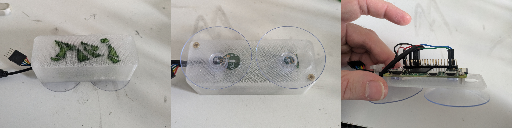
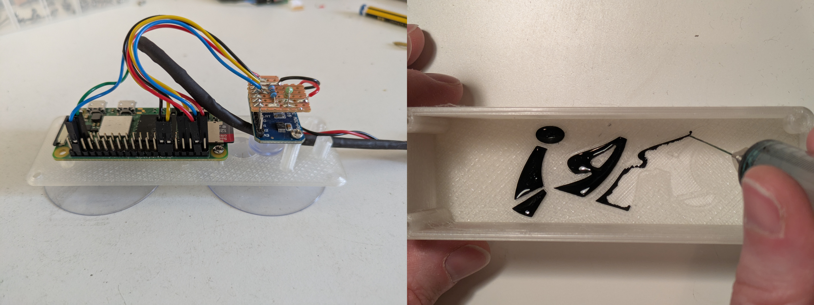

## About this Tutorial


In this tutorial, I’ll walk you through the minimal steps to build a **solar-powered home LAN streamer** that can also **automate recordings based on solar time**. We’ll be using the code from [our repository](https://github.com/sensingtheforest/audio-streamer), but if you’d like to modify it for your own projects (and you’re absolutely encouraged to!), check out [this more advanced tutorial](https://sensingtheforest.github.io/streamers/tutorial-3/) for more details — including standalone solutions to some of the most annoying problems we ran into when deploying our streamers in the forest.


## Shopping List

* [ ] Raspberry Pi Zero 2W
* [ ] Micro SD card (any size, we used 256GB but calculate storage needs based on recording time)
* [ ] **Stereo Audio Input Options we tested**:

  * [ ] 2 × MEMS microphones with breakout (no audio interface needed, extremely cheap but low quality)
    **OR**
  * [ ] RØDE AI-Micro + 2 × Lavalier GO (most usb audio devices and lavalier mics will work)

#### Solar Power Setup (optional)
* [ ] 1 × 120W solar panel
* [ ] Battery Charge Controller with 5V USB Output
* [ ] Any standard 12V car battery


## Hardwere setup

This part is mostly up to you! If you’re feeling adventurous and want to 3d-print the movable mic cases shown in the pictures, the RPi case, understanting the solar power requirements, or add a battery sensor, check out the [more advanced tutorial](https://sensingtheforest.github.io/streamers/tutorial-3/). 

Here, I’ll skip the solar power wiring details. If you use a solar panel from brands like EcoWorthy or similar, it usually comes with a controller. All you need to do is connect the 12V battery and the solar panel to the controller, then use the stepped-down 5V USB output to power the Raspberry Pi. Just keep in mind that solar panels should face south, and if you don’t need perfect optimization according to the season, an incline of about 45° or a little more should do the job.

#### Microphones

The USB audio devices are plug-and-play. Simply connect the micro-USB and run:

```bash
arecord -l
```

If see something like `USB Audio` or the name of your device, you're ready to proceed with the software setup. 

For the MEMS microphones, below a quick diagram illustrating the connections in a stereo configuration. (And yes... the wires are what they are...)


Connect the MEMS microphones and proceed with the software setup — they aren’t exactly plug-and-play, so we'll need the linux kernel headers and the drivers...

For a deeper explanation and tips on improving audio quality with the MEMS, or considerations about solar power requirements during winter refer again to the advanced tutorial. If your Raspberry Pi only powers itself and the two MEMS microphones, a single 120 W solar panel paired with a standard flooded lead-acid car battery should be sufficient even in winter. However, the seasonal difference is huge, and during months with limited sunlight (December and January), you may still experience periods offline.

#### Case

Below are models for two case designs with suction cups (about 5 cm in diameter) for window mounting.

* The first is ultra-compact and fits only the RPi Zero, with just enough room for the header connections.


  
* The second also includes space for an ADS1115 battery sensor — very handy when running on solar power!




## Software setup

Just a slightly more commented version of the steps described in our README.md file in the repo.

#### Prerequisites

If using MEMS microphones, enable I2S by editing the config file:
   ```
   sudo nano /boot/firmware/config.txt
   ```
   Add the following line at the end:
   ```
   dtparam=i2s=on
   ```
#### Setup

1. Download the project folder to your Raspberry Pi's home directory. From the home folder:
   ```
   sudo apt update
   sudo apt install git
   git clone https://github.com/sensingtheforest/audio-streamer.git
   ```
2. Install all the necessary libraries.
   * Grant execute permission to the scripts in the project folder:
   ```
   cd audio-streamer
   find . -type f \( -name "*.sh" -o -name "*.py" \) -exec chmod +x {} \;
   ```
   * Now run the install script:
   ```
   ./install.sh
   ```
   * When prompted, say yes to configure Icecast2. After that, you can just use the default settings. If you change the default passwords, make sure to remember them — you’ll need them later for the Icecast2 config file. When prompted to configure msmtp (email app), and asked that confusing question, just go with the default no.
   * Say yes to reboot — this is the final step of the installer. If you changed the kernel headers setting in installer.sh, the installer will finish without rebooting.
   * **Note**: The script should install all required packages from the repositories. All the packages are listed in the script. There are some parameters at the beginning of install.sh   you can set to spare some time, otherwise it will do a full OS upgrade and compile the latest darkice version. This may take a while - get a cup of tea... or two... 
3. For MEMS microphones, install drivers:
   ```
   ./mems-drivers.sh
   ```
   * Reboot when prompted (type `y`).
   * **Note**: If not using MEMS microphones, skip to step 4. 
4. Set up the microphone:
   * Open the setup script:
   ```
   sudo nano mic-setup___o.sh
   ```
   * Set DEVICE and FORMAT to match your microphone. You can find your device name running:
   ```
   arecord -l
   ```
   * Save the file as mic-setup.sh (remove "___o") and run it:
   ```
   sudo mv mic-setup___o.sh mic-setup.sh 
   ./mic-setup.sh
   ```
   * A 10-second recording test should start. You should see volume meters (or a vague memory of them) moving. Check for `mic-test.wav` in the project folder.
   * You can adjust the microphone capture volume in alsamixer. Run:
   ```
   alsamixer
   ```
   To see the fader, click on "F6: Select your soundcard", and then show all volume controls with "F5: All". <br>
   If you want to repeat the test and observe the signal levels, run:
   ```
   arecord -d 10 -D mic_out_shared -c 2 -r 44100 -f S16_LE -t wav -V stereo -v mic-test.wav
   ```
5. Configure settings:
   * Edit all remaining files ending in "___o" with your settings. Settings are commented inside each file (msmtprc___o.txt is optional, see step 7).
   * Save them without "___o" (e.g., edit `common___o.sh` and save as `common.sh`).
   * **Note**: You can keep the originals using `cp` instead of renaming them with `mv`, only those without `"___o"` will be used. I use mv to see right away which ones I've already edited.
6. Test the stream:
   ```
   ./stream.sh
   ```
   * If everything is set up correctly, you should be able to access the stream through your Icecast2 server address, which typically looks something like 192.168.0.172:8000.
If you’re unsure about the address, check which IP has been assigned to your Raspberry Pi from your home modem’s admin page.
   * **Note**: This assumes that `darkice.cfg` has been set up correctly, there are no errors in the terminal, and the last line ends with `SCHED_FIFO`.
7. (optional) Enable email operations:
   * Obtain an App Password from your email account (we used Gmail). **Don’t use your Google account password!** The app password is a special password created just for this purpose.
   * Update the 'from', 'user', and 'password' fields with your own credentials.
   * Save this file as a hidden configuration in your home folder and set the appropriate permissions.
   ```
   sudo mv msmtprc___o.txt ~/.msmtprc
   chmod 600 ~/.msmtprc
   ```
   * Enable IMAP on your email account to allow the Raspberry Pi to download attachments from your emails and receive remote updates.
8. (optional) Set up cronjobs for automatic problem solving and sending the logs:
   * Open the crontab editor 
   ```
   crontab -e
   ```
   * Copy and paste this content in the crontab and save.
   ``` 
   # The environment for cron jobs is more limited than your normal shell environment.
   # Setting the PATH variable here ensures proper path resolution for all cron-executed commands and scripts.
   export PATH=$PATH:/usr/local/sbin:/usr/local/bin:/usr/sbin:/usr/bin:/sbin:/bin

   # By default, if a cron job generates output (stdout or stderr), 
   # it's emailed to the user who owns the crontab.
   # Setting MAILTO to an empty string suppresses these emails.
   MAILTO=""

   # Health check every hour. Append states on uptime.log
   30 * * * * $HOME/audio-streamer/monitor.sh

   # At 3AM: check if darkice is streaming, if not reboot. 
   # Rebooting sends the log email so too often can be annoying... 
   0 3 * * * $HOME/audio-streamer/nuclear-option.sh

   ### (optional email operations, for this you need step 7)
   # At 9PM: send the log file and limit the lines to the last 50000.
   0 9 * * * $HOME/audio-streamer/rotate-log.sh; sleep 5; $HOME/audio-streamer/send-email.sh
   # Every 4 hours: look for an email with a specific subject, copy its attachments to the main folder, then run blank.sh.
   0 */4 * * * $HOME/audio-streamer/venv/bin/python $HOME/audio-streamer/update-code.py; sleep 10; $HOME/audio-streamer/blank.sh
   ```
     
9. (optional) Create boot service to start the streamer when you turn it on. **Don't use the @reboot line in crontab!** That is going to be trouble...
   * Open boot.service.txt
   ```
   sudo nano boot.service.txt
   ```
   * Replace the placeholder values in the 'ExecStart', 'User', and 'WorkingDirectory' fields with your actual username. Save and exit the editor.
   * Remove the extension and move the file to the correct systemd directory:
   ```
   sudo mv boot.service.txt /etc/systemd/system/boot.service
   ```
   * Reload systemd, enable the service to run at boot, and reboot the system:
   ```
   sudo systemctl daemon-reload
   sudo systemctl enable boot.service
   sudo reboot
   ```
   * After rebooting, you can check if the service is running properly with:
   ```
   sudo systemctl status boot.service
   ```
10. ENJOY!


