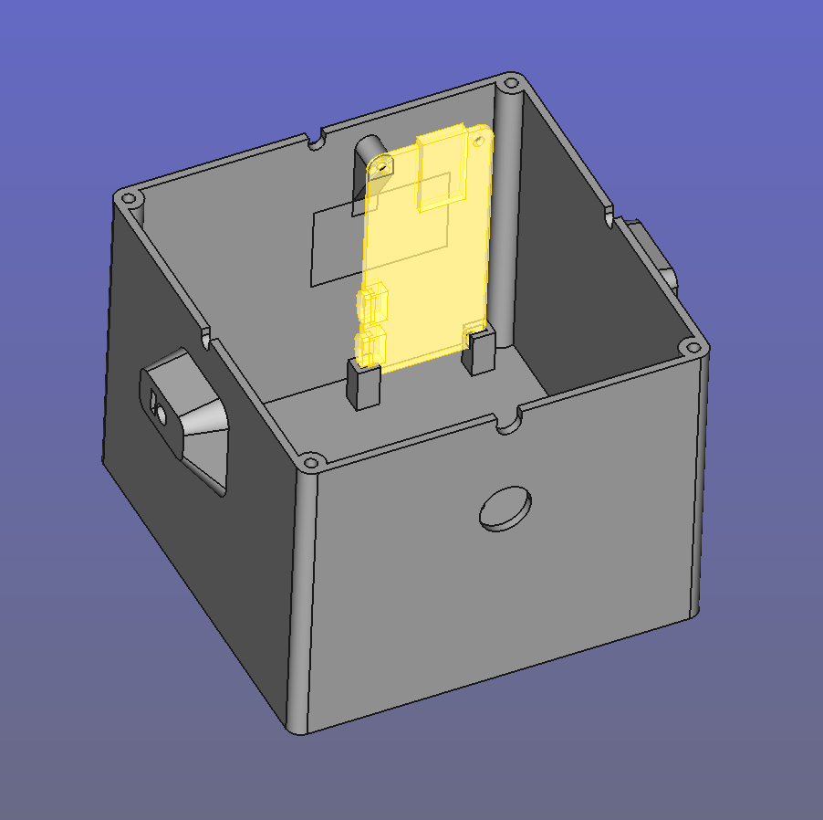

## About this Tutorial

In this tutorial, I explain how to build the exact same solar-powered audio streamers we use in the forest.

Getting to the final version was a bumpy ride, so this guide offers more of a behind-the-scenes look at the challenges I faced, how I solved them, technical insights into the code, and real-world solar power data to ensure continuous operation.

But don’t worry! If you just want to get started quickly, there’s a more direct how-to guide: first, check the **shopping list**, then follow the instructions in the **README file in our repository**. If something doesn’t work or you’re not sure what’s going on, come back here for detailed explanations and tips.  

As everyone seems to focus on large AI models that require supercomputers accessible only to a few, this project goes in the opposite direction — using simple tech, guided by clever ideas, to solve specific problems while embracing **limitations**. For example, if a technology performs better but isn’t readily available, or might discourage a curious DIYer from experimenting, I either avoid it or suggest a more accessible alternative, as long as the alternative can still solve the problem effectively. When I read online that more eco-friendly bioplastics aren’t recommended for outdoor use compared to petroleum-based plastics, I take that as a challenge to find ways to make them work. And more often than not, solutions are there, if you look for them!

Some of the problems tackled here — which also double as stand-alone tutorials — include:

* **Nailing solar power requirements for Raspberry Pi projects.** And yes, solar works even in the UK *if* you meet the right requirements. Blanket statements like “solar doesn’t work in the UK” aren’t helpful. Through field testing (and only field testing), you'll get to what actually works.
* **Scheduling events based on solar time instead of standard clock time.** We used this to capture the dawn chorus of birds, but the same script can automate anything from turning on a terrarium light at sunrise to watering plants at sunset.
* **Updating and checking your remote Raspberry Pi with a 4g Dongle without relying on paid remote access services.**
* **Answering the question: can you trust 3D printed PLA parts for outdoor use?** Spoiler alert: the answer isn’t “no.”
* **Assessing the performance of ultra-cheap MEMS microphones as an alternative to electret mics in DIY projects where audio quality matters.** 


## Contents

- [Features](#features)
- [Acknowledgements and Origins](#acknowledgements-and-origins)
- [Shopping List](#shopping-list)
- [Some Notes about the Microphones](#some-notes-about-the-microphones)
- [Overview of the Code Architecture](#overview-of-the-code-architecture)
- [The Safety Measures](#the-safety-measures)
- [How to Control the RPi from Your Home with a 4G Dongle — A real HACK!](#how-to-control-the-rpi-from-your-home-with-a-4g-dongle--a-real-hack)
- [Automating tasks at astral time — Birds don’t sing at office hours...](#solar-crontab--birds-dont-sing-at-office-hours)
- [The Simplest Battery Sensor: ADS1115 breakout with voltage divider](#the-simplest-battery-sensor-ads1115-breakout-with-voltage-divider)
- [Getting The Solar Panel Setup Right](#getting-the-solar-panel-setup-right)
- [3d Printed Enclosure](#3d-printed-enclosure)


In this tutorial, I explain how to build the exact same solar-powered audio streamers we use in the forest.

## Features

The streamer has the following features:

* Streams 24/7 stereo audio over the Internet
* Can automate recordings based on solar times (birds don't wear watches!)
* Built with DIYers in mind: Raspberry Pi, open-source code, 3D printing, and affordable, accessible materials
* Small and portable
* Stable and weather-resistant — it can run for months in harsh environments with no maintenance
* Uses the most eco-friendly materials we could reasonably find
* Fully solar-powered
* Remote monitoring and troubleshooting via 4G dongle (includes software updates, shell access, etc.)
* Local access via smartphone hotspot
* Range of audio qualities — suitable for curious DIYers looking for budget solutions, or audiophiles working with dedicated interfaces.

Everything shared here has been field-tested. Our streamers have worked for months, running on solar power even during UK winters, withstanding rain and snow. In their final version, they required minimal maintenance — and I'd say almost none if it weren’t for Storm Darragh, which briefly turned the solar panel into a sail before we tied everything to heavy logs...


---

## Acknowledgements and Origins

Thanks to George Xenakis and Michael Bell from Forest Research for their practical, experience-based suggestions, which consistently proved accurate and saved us a great deal of trial and error. Thanks to Danielle, Jack, and ... at Forestry England for guiding us through the forest and supporting us at every step of the deployment.

Also, huge credit to the amazing [Locusonus project](https://locusonus.org/vitae/index.php?page=Locustream.en) (active since 2006), and their [streambox tutorial](https://locusonus.org/streambox/) — both of which were invaluable starting points.

That said, our 2024 project had different needs, and in the end, it evolved significantly from the original. Here's how it differs:

### Key Differences from the Streambox

* Uses standard Raspberry Pi OS instead of Arch Linux
* No need to give remote access to anyone
* No pre-built OS image: we use a modular approach based on the latest RPi OS + online installers
* Enables multi-use setups: users can run other tasks on the Pi alongside streaming/recording
* Built-in safety checks for remote deployment — automatic issue resolution
* New features:

  * Solar time-based automation
  * Remote code updates and shell access via 4G dongle

---

## Before you start

Make sure you understand the risks of leaving a 12V battery unattended in the field. I’ll repeat it throughout, but it’s worth saying clearly up front:
**Always use a fuse like shown in the main diagram, and thoroughly test your enclosure under both water and direct sunlight.**

**Don’t assume that in 2025 all remote areas have reliable network coverage.**
Alice Holt is a great example. Even in a well-visited, family-friendly forest managed by Forestry England, Anna and I spent a lot of time walking around with SIM cards from four different providers — and still found surprisingly few spots where even one offered a solid signal for our streamer to work.

---


## Shopping list

#### Core Components

* [ ] Raspberry Pi Zero 2W
* [ ] Micro SD card (any size, we used 256GB but calculate storage needs based on recording time)
* [ ] **Stereo Audio Input Options we tested**:

  * [ ] 2 × MEMS microphones with breakout (no audio interface needed, extremely cheap but low quality)
    **OR**
  * [ ] RØDE AI-Micro + 2 × Lavalier GO (or other lavalier mics)


#### Solar Power Setup

* [ ] Weather-resistant enclosure (we used a 24-litre Strata storage box made of recycled plastic)
* [ ] Battery Charge Controller with 5V USB Output
* [ ] 5A Fuse
* [ ] Fuse case

* [ ] Winter (December–January)
  * [ ] 4 × 120W solar panels (we used Eco-Worthy)
  * [ ] 120Ah 12V caravan battery

* [ ] Autumn & Spring
  * [ ] 2 × 120W solar panels
  * [ ] Any standard 12V car battery

* [ ] Summer
  * [ ] 1 × 100W solar panel
  * [ ] 7Ah 12V battery

> **Note**: These configurations worked for our specific conditions, and they are on the safe side. Solar requirements vary enormously based on region, sunlight exposure, and shading. For detailed explanation, refer to the relevant section in the guide.


#### Streaming Without LAN

* [ ] 4G USB modem
* [ ] Data SIM card with a suitable monthly plan
* [ ] Audio streaming host (we used StreamUp, supports up to 320 kbps OGG/VORBIS)


#### Battery Monitoring (Optional but very useful to nail the solar power requirements)

* [ ] ADS1115 breakout board
* [ ] 1 × 100kΩ resistor
* [ ] 1 × 330kΩ resistor
* [ ] Small stripboard (with vertical layout preferred)


#### 3D-Printed Case (Optional)

* [ ] 3D printer (to print from our shared model files)
* [ ] 4mm decorative aluminium wire
* [ ] Micro USB input breakout
* [ ] 12mm round waterproof on/off switch
* [ ] 5 × #2 self-tapping pan head 5mm screws
* [ ] 4 × #4 self-tapping pan head 5mm screws
* [ ] 3 × M3 square nuts
* [ ] 3 × M3 pan head 10mm bolts

---
<br>
<br>
<br>


## Notes about the Microphones

Choosing the right microphone turned out to be quite tricky. Since the equipment would be left unsupervised in a forest, often near a path, starting with high-end gear wasn’t an option.

A common solution online involved using Pi audio HATs with electret microphones, but these HATs tend to go out of production quickly. I wanted something that wouldn’t require rewriting code or adapting to new hardware every few months — so I ruled that out.

**USB microphones** were the next option. Most of the ones I tested were electret-based with onboard ADCs and worked plug-and-play on the Pi (see the first tutorial). But they’re typically mono. Using two with a USB hub might work, but you also need to power a 4G modem from the same hub — all running on battery. More importantly, I wanted flexible mic placement to control the stereo image, and USB mics in their housings make that harder. Bare capsules are easier to mount, protect from rain, and fit into custom 3D-printed enclosures.

**MEMS microphones** offered a lot of advantages:

* No need for an external audio interface or Pi HAT. ADC is onboard the coin-sized breakout.
* Most have 32-bit resolution.
* Extremely low current draw.
* Connect directly to the GPIO.
* Dirt cheap — you can get two (for stereo) for under £5.

For initial tests, especially with an untested DIY waterproof enclosure and uncertain site security, MEMS seemed like the perfect option.

However, their low current draw made them **very sensitive to interference**. 

After solving the interference issues, the quality was acceptable when sounds were relatively loud. But in the forest, silence is common, and at night or during quiet periods, the background noise (digital and noticeable) became an issue.

I then tested a very small audio interface designed for lavalier mics — compact enough to fit in an enclosure meant to go conmfortably up a tree. Few models offer dual input, but the **RØDE AI-Micro** with two **Lavalier GO** mics did the job. The improvement in interference was significant. The modem could sit much closer without problems, and even with the included 1.5 m unbalanced cables coiled up inside the box (right next to the battery wiring!), there was no noticeable interference — surprisingly stable for an unbalanced setup.

Setting up these USB devices is much easier than working with MEMS or Pi HATs. By following the instructions in the README file, you should have them up and running quickly.

> **Note:** The Rode AI-Micro comes — strangely — set to mix the left and right channels into mono by default. If you're using it, make sure to reconfigure it with the provided software, otherwise, you won't get separate left and right channels. This has to be done from a non-Linux machine.

The lavaliers with the AI-Micro is the final audio setup I used to record all the audio files you can hear on Free Sound (link), but only **from March onward**, when I switched from MEMS to the Lavaliers.

---

#### *MEMS michrophones - Gradus ad Parnassum* (or maybe just a slightly less ambitious destination…)

MEMS microphones seem to be here to stay — and they might just become the go-to alternative to the ever-present electret mics for DIY projects. So here’s a bit of experimentation.
No sonograph allowed! Dear DIYer: if I say *“the audio here isn’t good”* but it sounds fine to you, you can skip the suggested improvements.

MEMS posed more problems than advertised.

**Step 1: just make it work.**

For the wiring, there is plenty of info online. [This project](https://makersportal.com/shop/i2s-mems-microphone-for-raspberry-pi-inmp441?srsltid=AfmBOoqB_DKFbKob098QTqIUZ4KEqHDwAs-WXdSmoxllFCNxPV8H_8t5) used exactly the MEMS breakout I found in stereo configuration, and the pins on Raspberry Pi zero 2W are the same.

You'll need to solder the headers and probably have a crimper for the connections. Initially, just use whatever cables you have.

Here’s what a MEMS mic can sound like if you:

* mismatch the bit resolution,
* don’t shield the cables, and
* use cables that are too long.

[▶️ Sound of MEMS with bit mismatch and unshielded cables, mono](https://raw.githubusercontent.com/sensingtheforest/sensingtheforest.github.io/main/src/assets/audio/1_mems_mono_16bit_shield-not-grounded.wav)

Keep in mind that these recordings were made in quiet settings, and the volume is relatively high to make details more audible.
But I promise, I’m not recording a synth with a random LFO — what sounds like a vintage oscillator is pure interference picked up by the unshielded cables in a noisy RF environment! Listening to nighttime forest sounds with this setup would be an unpleasant experience...

**Step 2: let’s get the cable length and shielding right.**

Now you’ll almost certainly need to deal with the shield, and 5-core shielded cables aren’t exactly common. You should be able to find them online, or you can make your own DIY shield.


The bit resolution is still mismatched, but the cables are now shielded — with the shield connected only on the Raspberry Pi side, tied to ground along with the cable ground.

[▶️ Sound of MEMS with bit mismatch and 50cm shielded cables, mono](https://raw.githubusercontent.com/sensingtheforest/sensingtheforest.github.io/main/src/assets/audio/2_mems_mono_16bit_shilded_medium-cable.wav)

The "synth" is quiter but still noticeably there. Cables are probably too long. Let's cut them from 50cm to about 15cm.

[▶️ Sound of MEMS with bit mismatch and 15cm shielded cables, mono](https://raw.githubusercontent.com/sensingtheforest/sensingtheforest.github.io/main/src/assets/audio/3_mems_mono_16bit_shielded_short-cable.wav)

Now, the “synth” is almost gone. Not perfect, but a major improvement. 

>**Note:**  There's no fixed rule for cable length. It depends entirely on the strength of RFI (radio frequency interference) in your environment. If you place the setup near a power line or a strong light source, it might not work at all. But in a low-interference area, a 1-meter cable might be just fine.

**Step 3: Can a bit-depth mismatch really cause that much trouble?**

My bit depth was 16-bit (S16\_LE). That’s wrong for most MEMS mics, which are typically 32-bit (S32\_LE).
This is the relevant part of the ALSA config file (`/etc/asound.conf`) 

```
pcm.mic_hw {
    type hw
    card sndrpii2scard
    channels 2
    format S16_LE   #16-bit is usually wrong for MEMS
}
```

[▶️ Sound of MEMS with bit depth mismatch, shielded and short cables, stereo](https://raw.githubusercontent.com/sensingtheforest/sensingtheforest.github.io/main/src/assets/audio/4_mems_stereo_16bit-instead-of-32_short-cable.wav)

Fixing the bit mismatch in the ALSA config file improved things a lot.

```
pcm.mic_hw {
    type hw
    card sndrpii2scard
    channels 2
    format S32_LE
}
```

[▶️ Sound of MEMS with correct bit depth, shielded and short cables, stereo](https://raw.githubusercontent.com/sensingtheforest/sensingtheforest.github.io/main/src/assets/audio/5_mems_stereo_32-bit-as-intended_short-cable.wav)

These recordings are from a morning in Bristol, and yes, we have a lot of seagulls here.
I expected it to reduce background noise — no surprises there — but it also helped significantly with interference when I moved everything to the forest, which I hadn’t anticipated, at least not to that extent. 

ALSA can be a bit unforgiving. If you don’t know the exact bit format of your device (not just the depth, but the label), it’s a real problem. Unfortunately, to figure it out for sure, you’ll probably need tools that come with PipeWire. That's what I used to discover that the AI-Micro works with 24-bit audio, 3 bytes per sample, Little Endian (S24_3LE). But if you’d rather avoid installing all that, a few educated guesses usually work. Start by trying `S32_LE`, then `S24_LE`.

**Step 4: The mic sounds decent, time to plug in the modem and head to the forest? Not so fast...**

You plug in the modem — and you hear a nasty glitch. You might think the mic’s broken. It’s not. That sound is *modem interference*, especially if you're trying to place it inside the same box as the MEMS mic and audio cables.

[▶️ Sound of MEMS next to the modem, stereo](https://raw.githubusercontent.com/sensingtheforest/sensingtheforest.github.io/main/src/assets/audio/6_mems_mono_16bit_near-modem.wav)

That’s the reason I built a separate modem case, connected by an aluminium wire — to isolate it from the audio path.

Move the modem farther away, and the glitch starts to fade:

[▶️ Sound of MEMS 30cm away from the modem, stereo](https://raw.githubusercontent.com/sensingtheforest/sensingtheforest.github.io/main/src/assets/audio/7_mems_mono_16bit_far-modem.wav)

And with proper shielding and enough distance, we’re back to where we started before plugging in the meodem.

---

**Circuit corrosion is real in the forest**


On the left pic, you can see what happened to the exposed circuits after just a few weeks without protection.<br>
On the right, the fix: **applying acrylic conformal coating with a tiny brush solves the issue** — just make sure not to cover the mic hole!

In the rainy season, corrosion progresses faster, but it always starts gradually. Listen to the left channel below: the clicks aren’t rain; compare them to the right channel. This recording was made on September 23.

[▶️ Sound of MEMS with beginnings of corrosion on the L channel](https://raw.githubusercontent.com/sensingtheforest/sensingtheforest.github.io/main/src/assets/audio/8_oxidation-start.wav)

And yes, when advanced corrosion causes full short circuits, it can sound a lot closer to a Merzbow performance than to an idyllic forest soundscape! This is how it sounded on September 27, after four more humid days—volume reduced by 12 dB to spare your ears...

[▶️ Sound of MEMS with advanced corrosion on the L channel](https://raw.githubusercontent.com/sensingtheforest/sensingtheforest.github.io/main/src/assets/audio/8_oxidation-full.wav)


---
<br>
<br>
<br>


## Overview of the Code Architecture


Most of the code is written in Bash, with Python scripts handling more time-sensitive tasks like reading the battery sensor and syncing with solar time.
System functions and global variables are defined in the `common.sh` script. <br>
**`common.sh` also acts as the main user configuration file. Many parameters of the streamer can be adjusted there, and each option is commented directly in the file.**

For audio streaming, I used Darkice, like Locusonus and many other similar projects online.

For full details, the code is available in our [GitHub repository](#), and it's (hopefully!) well-commented. But here's a quick overview of the core structure of the streaming component:


```bash
boot.sh -> opens a detached screen session that runs stream.sh
   └── stream.sh -> runs monitor_stream() (a main while loop)
         └── monitor_stream() -> checks if darkice is running
               └── If not, starts darkice via start_darkice()
```


##### Monitoring Strategy

Instead of a simple `ps aux | grep darkice` process check (which often fails in edge cases), I implemented **live terminal parsing** of Darkice's output:

* If output ends with `SCHED_FIFO` → everything is fine, set streamer state to `1`
* If keywords like `reconnecting  0` or `TcpSocket` appear → set state to `0`, even if it later recovers (more about this later)

This state is stored in the `state.txt` file and read regularly to assess streaming health.


##### Why Live Parsing?

During field testing, I noticed Darkice could remain an active process but **fail silently** — e.g., not actually streaming due to a network dropout or crash. Live output parsing fixed that.

Now, if Darkice hits a known error state, it's killed and restarted. This even helps revive the remote streaming server — in our case StreamUp – likely because restarting triggers a fresh connection that resets the server-side socket state.

> **Note:** This method depends on specific terminal outputs from Darkice (set using `verbosity=6`). If future Darkice versions change these messages, the function will need to be updated.

---

#### Persistent Execution

* The main loop (`monitor_stream`) runs inside a **detached screen session** so it can operate independently of SSH connections.
* `boot.sh` sets everything in motion by launching the screen session at system startup using a **systemd** service.

See **Tutorial One** for setup instructions on using `screen` and `systemd` together.

---
<br>
<br>
<br>


## The Safety Measures

If you plan to leave the Streamer in a remote area, these are really (but REALLY) important. In the forest, literally everything that *could* go wrong, *did* go wrong. So here we tackle the software side of surviving the wilderness. Sure, if a tree falls on the Streamer, software won’t save you—but for many other adversities, we have error routines.

There are four levels of checks.

---

#### Level 1: `start_darkice()`

```bash
start_darkice() {
    if status_darkice; then
        log "start_darkice() - Darkice already running -> Kill and restart"
        kill_darkice
    fi
    log "start_darkice() - Start darkice with real-time output line check"
    sudo darkice -c "$PROJECT_FOLDER/darkice.cfg" -v 6 | while IFS= read -r darkice_line; do
        echo "$darkice_line" | tee -a "$LOG_FILE"
        if [[ "$darkice_line" == *"reconnecting  0"* || "$darkice_line" == *"TcpSocket"* || "$darkice_line" == *"No such device"* ]]; then
            set_darkice_state 0
        elif [[ "$darkice_line" == *"SCHED_FIFO"* ]]; then
            set_darkice_state 1
        fi
        sleep 0.1
    done
}
```

This function in `common.sh` watches Darkice’s terminal output in real time and flags issues we learned the hard way after a year of forest deployment. Around 80% of those issues were internet-related.

* `'reconnecting  0'` and `'TcpSocket'` usually meant the modem or network coverage had a meltdown.
* `'No such device'` was a fun one—it appeared when the AIMicro or Rode lav mic just decided not to exist anymore (after *months* of working fine, of course). It turned out the issue was failing USB cables or connections, which caused power shortages to the USB peripherals. Obviously, I didn’t get a simple on/off failure — that would’ve been easier to deal with. Instead, I had to troubleshoot increasingly intermittent and unreliable behaviour...

This function only **flags** problems. The actual fixing comes in later steps.

---

#### Level 2: `monitor_stream()`

This function runs every `DARKICE_MONITOR_INTERVAL` seconds (default: 60 — tweak it in `common.sh`). It checks the Darkice streaming state stored in `state.txt`.

If the flag is 0, it restarts Darkice. This solved a really annoying issue: when Darkice froze, sometimes the streaming server froze too. So even after Darkice came back, the server stayed unresponsive until we manually restarted it via CentovaCast.

Magically, restarting Darkice in these situations solved the server issue. Why? No idea. Maybe it reset the transmission protocol. Maybe it was just scared of getting rebooted again. But it worked.

---

#### Level 3: `monitor.sh`

This script is triggered by `crontab` every hour and takes a more “surgical” approach to problem-solving.

**Summary of what it does:**

* Checks if the Raspberry Pi has internet access.
* If not:

  * If using a dongle (not Wi-Fi), check and refresh the dongle's IP. If still down, reboot the dongle.
  * If using Wi-Fi, try reconnecting to known networks.
* If the internet comes back, restart the streaming session.
* Then verify if Darkice is *really* streaming (not just running). If stuck, kill the stream session and restart it.
* If recording is enabled, make sure `solar-crontab.py` is running. If not, restart it in a `screen` session.

---

#### Level 4: `nuclear-option.sh`

A bit of a dramatic name for a script that *just reboots the system*. But hey, when you're 5 hours away and stuck without logs, dramatic works.

Working in the forest was lovely—coding on a fallen tree while birds chirped around me—but driving back and forth every time the Pi decided to sulk wasn’t ideal.

The nuclear option was designed for those moments when nothing else works—especially if the modem crashes or your mobile provider surprises you with an unexpected IP change. The Raspberry Pi doesn’t always handle these disruptions gracefully, and sometimes a reboot is the only way to recover. Even before proper fallback routines kick in, a simple reboot can buy you another 12 hours of IP lease. And those 12 hours might be all you need to regain remote access and fix the issue.

In my case, those extra 12 hours after each reboot gave me time to remotely assign a permanent IP address to the modem, solving the lease expiry problem, thus sparing me a trip to the site, and, most importantly, avoiding any loss of recordings.

I set up this script to run once a day at 3 AM. Since rebooting sends logs via email and could cause more things to go wrong than the monitor script, I keep it rare.


---
<br>
<br>
<br>

## How to Control the RPi from Your Home with a 4G Dongle — A real HACK!

When I finally got the 4G dongles to work, it sounded great... until I realized I couldn’t just SSH into the Raspberry Pi sitting deep in the woods. These dongles with SIM cards basically act like smartphones — and you wouldn’t want people SSH-ing into your phone either, right? Carriers make sure of that by throwing in things like CGNAT and constantly changing public IPs. Great for security, terrible for remote hacking (uh, I mean *maintenance*).

Sure, you could pay for services that give you a stable IP and remote access — just like they do for security cams — but where’s the fun in that? Hacks are free, fun, and they add that touch of cyberpunk.

---

#### Wait... Viruses Do This All the Time!

The idea is simple. Viruses often work by getting you to download a sketchy file that runs code on your machine. What if *we* are both the sender *and* the receiver — and we actually *trust* our code? Congratulations, you just reinvented the concept of **automatic updates**.

In a few words: we have a shared space (like an email inbox), the RPi checks it regularly, and if it finds something shiny (aka an email with a subject of your choice and with an attachment), it downloads and runs it.

---

### The Simplest Possible Shared Repo: Email

Yes. Email. Literally Gmail.

To set this up:

* Enable IMAP on your Gmail account
* Write a Python script that checks for emails with a specific subject and grabs the attachments
* Tell the Pi to run that script on a schedule and execute the goodies it downloads

#### How to Enable IMAP on Gmail

1. Open Gmail, click the gear icon (top-right), then “See all settings”
2. Go to **Forwarding and POP/IMAP**
3. Under **IMAP Access**, select “Enable IMAP”, then click “Save Changes”

Done.

---


#### The Python Snippet That Does the Job

This little script checks your Gmail inbox, looks for emails with a certain subject from the past few days (tweak this with the var SEARCH_DAYS), and downloads any attachments into your Pi's project folder.
**Heads up:** Don’t forget to update the placeholders in the Email account credentials section before running it!

```python
from pathlib import Path
import imaplib
import email
import os
from datetime import datetime, timedelta

# --- Email account credentials and script config (edit this section!) ---
IMAP_SERVER = "imap.gmail.com"
EMAIL_ACCOUNT = "your-email@gmail.com"
PASSWORD = "your-app-password"  # Use a Google app password, not your main account password
PROJECT_DIR = Path(__file__).resolve().parent
SEARCH_SUBJECT = "update code myProjectName"  # <-- Change to match your subject line
SEARCH_DAYS = 3  # Number of days to look back in the inbox
# ------------------------------------------------------------------------

print("______________UPDATE CODE")

# Calculate the date x days ago in IMAP format (DD-MM-YYYY)
date_x_days_ago = (datetime.now() - timedelta(days=SEARCH_DAYS)).strftime("%d-%b-%Y")

# Connect to email server
mail = imaplib.IMAP4_SSL(IMAP_SERVER)
mail.login(EMAIL_ACCOUNT, PASSWORD)
mail.select("inbox")

# Search for emails with the subject and date filter
search_criteria = f'(SINCE {date_x_days_ago} SUBJECT "{SEARCH_SUBJECT}")'
status, messages = mail.search(None, search_criteria)

email_ids = messages[0].split()
if not email_ids:
    print(f"No recent emails found with subject: {SEARCH_SUBJECT}")
else:
    latest_email_id = email_ids[-1]
    status, data = mail.fetch(latest_email_id, "(RFC822)")
    msg = email.message_from_bytes(data[0][1])

    print(f"From: {msg['From']}")
    print(f"Subject: {msg['Subject']}")
    print(f"Date: {msg['Date']}")

    # Loop through email parts to find attachments
    for part in msg.walk():
        if part.get_content_disposition() == "attachment":
            filename = part.get_filename()
            if filename:
                filepath = os.path.join(PROJECT_DIR, filename)
                with open(filepath, "wb") as f:
                    f.write(part.get_payload(decode=True))
                print(f"Saved attachment: {filepath}")

mail.logout()
print("DONE")
```

---

### What If You Just Want to Run Shell Commands?

Great question. You’re not always uploading new scripts — sometimes you just want to run a `reboot`, or log the CPU temp, or sacrifice a process to the gods of uptime.

Here’s the plan: we download a shell script via email (same method as above), and run it if it exists. Since we’ve already automated the email checking, we don’t want to repeat the commands every time the cronjob kicks in.

So, here comes the little extra step that makes it all neat and modular.

This helper script (blank.sh) looks for a file called commands-tray.sh in the project folder — a sort of “meal tray” you send via email. It contains all the commands you want the RPi to execute.

The moment it finds this tray, it eagerly devours its contents (i.e., runs the commands), logs the output, and then throws the tray in the bin (i.e., deletes commands-tray.sh) so it doesn’t rerun the same stuff over and over—unless you forget to delete the email, in which case it will keep finding commands to execute.

```bash
source "$(dirname "$(realpath "${BASH_SOURCE[0]}")")"/common.sh
script_name=$(basename "${BASH_SOURCE[0]}")

commands_script="$PROJECT_FOLDER/commands-tray.sh"
temp_log=$(mktemp)

if [[ -f "$commands_script" && -s "$commands_script" ]]; then
    log "$script_name - Executing $commands_script..."
    log "$(cat $commands_script)"
    source "$commands_script" > >(tee -a "$temp_log") 2>&1
    log "$(cat "$temp_log")"
    log "$script_name - Execution completed. Deleting $commands_script..."
    sudo rm -f "$commands_script" && rm -f "$temp_log"
else
    log "$script_name - No commands to execute."
fi

if [[ -n "$reboot" && "$reboot" -eq 1 ]]; then
    log "$script_name - Rebooting now..."
    sudo reboot
fi
```


---

#### Automate blank.sh With Cron

We want the RPi to check its inbox regularly, so we set up a cronjob:

```md
0 * * * * $HOME/audio-streamer/venv/bin/python $HOME/audio-streamer/update-code.py && sleep 10 && $HOME/audio-streamer/blank.sh
```

This runs every hour. If you're confident everything’s stable, once a day should be fine too.

---

That’s it. You’ve now got remote, wireless, email-powered code deployment and shell control for your Raspberry Pi in the middle of nowhere — no subscriptions, no exposed SSH ports, no nonsense. Just some hackery.

---


#### Remote Command Greatest Hits (Only the Ones That Actually Worked)

Here’s a little greatest hits mixtape of the remote commands I sent to the streamer. Only the ones that *actually did something useful* made it into this list.

> Reminder: `blank.sh` uses `source` to load commands-tray.sh (not a subshell), so all the global variables from `common.sh` are available in the current session.


- **Reboot**

This is the **only command with special syntax** because it gets executed **after** the script finishes.
**Don't** use `sudo reboot` here — otherwise, the script will halt before cleaning up temporary files or deleting itself.

```bash
reboot=1
```

From here on, just standard bash...


- **Send the Latest System Log**

You'll receive `sys.log` in your inbox the next time `blank.sh` runs.

```bash
$PROJECT_FOLDER/send-email.sh
```


- **Get the Current Configuration Files of the Streamer**

Send the key config files one by one.

```bash
$PROJECT_FOLDER/send-email.sh -a $PROJECT_FOLDER/darkice.cfg -s "STREAMER CONFIG: darkice.cfg"
$PROJECT_FOLDER/send-email.sh -a $PROJECT_FOLDER/update-code.py -s "STREAMER CONFIG: update-code.py"
$PROJECT_FOLDER/send-email.sh -a $PROJECT_FOLDER/solar-crontab.py -s "STREAMER CONFIG: solar-crontab.py"
$PROJECT_FOLDER/send-email.sh -a $PROJECT_FOLDER/common.sh -s "STREAMER CONFIG: common.sh"
$PROJECT_FOLDER/send-email.sh -a ~/.msmtprc -s "STREAMER CONFIG: msmtprc"
```

Or just send them all in one email — `send-email.sh` accepts multiple attachments.

```bash
$PROJECT_FOLDER/send-email.sh \
  -a $PROJECT_FOLDER/darkice.cfg \
  -a $PROJECT_FOLDER/common.sh \
  -a $PROJECT_FOLDER/update-code.py \
  -a $PROJECT_FOLDER/solar-crontab.py \
  -a ~/.msmtprc \
  -s "STREAMER CONFIG: Full config dump"
```

- **Update cronjobs**
  
Replace specific lines in your crontab with new ones.

Edit the remote update check to run every hour (at minute 20),
instead of every 4 hours as defined in the default cronjob.

```bash
crontab -l | sed 's|0 \*/4 \* \* \* \$HOME/audio-streamer/venv/bin/python \$HOME/audio-streamer/update-code.py|20 * * * * $HOME/audio-streamer/venv/bin/python $HOME/audio-streamer/update-code.py|' | crontab -
```

- **Amend a cronjob to use a new script**
```bash
crontab -l | sed 's|\$HOME/audio-streamer/email-log.sh|\$HOME/audio-streamer/send-email.sh|' | crontab -
```

- **Save your crontab contents to sys.log and send it**
```bash
crontab -l >> "$PROJECT_FOLDER/sys.log"
$PROJECT_FOLDER/send-email.sh
```

- **Log all audio files and email the list**
```bash
ls -1 "$PROJECT_FOLDER/audio" > "$PROJECT_FOLDER/rec.log"
$PROJECT_FOLDER/send-email.sh -a $PROJECT_FOLDER/rec.log -s "STREAMER DATA: Audio recordings log"
```

- **Uploaded a sys file and it's not working? Often, a just matter of permissions**
  
Check the sys.log for clues: it usually shows a "permission denied" error. To solve this, grant read permission (+r) to all users (a) to fix it and try sending it again via email:
```bash
sudo chmod a+r /etc/asound.conf
$PROJECT_FOLDER/send-email.sh -a /etc/asound.conf -s "STREAMER SOUNDSCAPE: Current asound.conf"
```


---
<br>
<br>
<br>


## SOLAR CRONTAB — *Birds don’t sing at office hours!*

The usual way to schedule things on Linux is with good old `crontab`. You pick an hour, a day, a month, and the job gets done. But nature doesn’t run on clocks — it runs on light.

When we set up our forest recorder, we really wanted to capture dawn choruses of the birds that starts just before sunrise and fades as the day begins. So syncing with the sun was a must.

That's where this script comes in: it triggers scripts or Python functions **based on solar events**, not man-made time. It's flexible too — I've used it to turn on terrarium lights, water a garden, and yes, start a remote recording session as soon as the birds start gossiping.

This version is cleaned up and doesn't depend on the audio streamer repo, so you can use it for any project.

---

#### How it works

* You define a **location** (lat/lon + timezone).
* You specify some **solar ratios**:
  `0` = sunrise, `1` = solar noon, `2` = sunset.
  You can get creative — e.g., `2.5` is halfway between sunset and the *next* sunrise (i.e., middle of the night).
* You assign a **command** (bash script or Python function) to each ratio.
* The script checks the solar events for *today*, waits until the next one, runs the command, and repeats forever like a tiny sun-worshipping daemon.

---

#### Python script and setup


```python
from pathlib import Path
import os
from datetime import datetime, timedelta
import time
import zoneinfo
from astral import LocationInfo
from astral.sun import sun

#################################################
# Edit your parameters here:

location = LocationInfo("Alice Holt Forest", "UK", "Europe/London", 51.1699307, -0.8371404)

# Solar ratios: 0 = sunrise, 1 = noon, 2 = sunset, 2.5 = night (between sunset and sunrise)
solar_ratios = [0.0, 1.0, 2.0, 2.5]

SCRIPT_DIR = Path(__file__).resolve().parent
commands = [""] * len(solar_ratios)

# Shell scripts or Python functions
commands[0] = os.path.join(SCRIPT_DIR, "record.sh")
commands[1] = os.path.join(SCRIPT_DIR, "record.sh")
commands[2] = os.path.join(SCRIPT_DIR, "record.sh")
commands[3] = os.path.join(SCRIPT_DIR, "record.sh")

# If you need to use Python functions instead of shell scripts,
# assign them without parentheses or arguments. You can mix bash and Python functions.
# commands[0] = myPythonFunction

#################################################


tz = zoneinfo.ZoneInfo(location.timezone)

def execute_command(command):
    if command is None or (isinstance(command, str) and command.strip() == ""):
        print("Nothing to run.")
        return

    if isinstance(command, str):
        os.system(command)
        print(f"Executed shell command: {command}")
    elif callable(command):
        try:
            command()
            print("Executed Python function.")
        except Exception as e:
            print(f"Error in Python function: {e}")
    else:
        print(f"Unsupported command type: {type(command)}")

def get_sun_times(location):
    today = datetime.now(tz).date()
    sun_times = sun(location.observer, date=today, tzinfo=tz)
    return sun_times["sunrise"], sun_times["sunset"], sun_times["noon"]

def datetime_to_timedelta(dt):
    return timedelta(hours=dt.hour, minutes=dt.minute, seconds=dt.second)

def calculate_intermediate_time(start, end, ratio):
    return start + (end - start) * ratio

def convert_ratios_to_times(ratios, sunrise, noon, sunset):
    sunrise_td = datetime_to_timedelta(sunrise)
    noon_td = datetime_to_timedelta(noon)
    sunset_td = datetime_to_timedelta(sunset)
    times = []

    for ratio in ratios:
        if ratio <= 1:
            td = calculate_intermediate_time(sunrise_td, noon_td, ratio)
        elif ratio <= 2:
            td = calculate_intermediate_time(noon_td, sunset_td, ratio - 1)
        else:
            td = calculate_intermediate_time(sunset_td, sunrise_td + timedelta(days=1), ratio - 2)
        times.append(datetime.combine(datetime.today(), datetime.min.time(), tz) + td)

    return times

def print_solar_times(ratios, times):
    print("Today's solar events:")
    for ratio, time in zip(ratios, times):
        print(f"  → Ratio {ratio}: {time.strftime('%H:%M:%S')}")

def calculate_delay(target_time):
    now = datetime.now(tz)
    delay = (target_time - now).total_seconds()
    return delay + 86400 if delay < 0 else delay

# Main loop
if __name__ == "__main__":
    print(f"Location: {location.name}, {location.region}")
    print(f"Lat: {location.latitude}, Lon: {location.longitude}")

    while True:
        sunrise, sunset, noon = get_sun_times(location)
        solar_times = convert_ratios_to_times(solar_ratios, sunrise, noon, sunset)
        print_solar_times(solar_ratios, solar_times)

        delays = [calculate_delay(t) for t in solar_times]
        next_idx = delays.index(min(delays))

        next_time = solar_times[next_idx]
        next_delay = delays[next_idx]
        next_ratio = solar_ratios[next_idx]
        next_command = commands[next_idx]

        print(f"Next event (ratio {next_ratio}) in {int(next_delay)} seconds at {next_time.strftime('%H:%M:%S')}")
        time.sleep(next_delay)

        execute_command(next_command)
        print("Waiting one minute to avoid double-triggers...\n")
        time.sleep(60)
```


---
<br>
<br>
<br>


## The Simplest Battery Sensor: ADS1115 breakout with voltage divider

The battery sensor is incredibly useful for monitoring a solar-powered setup. This one is pretty basic, but it gets the job done. I used a common analog-to-digital converter (ADS1115) to read the battery voltage directly, and a simple voltage divider—just two resistors—to scale the 12 V down to 3.3 V (with some headroom), which the Raspberry Pi can safely read on one of its GPIO input pins. For the voltage divider I soldered a piece of breadboard with the conductive side up.


You should **definitely include a fuse** in this setup. If you leave it in a place with fire hazard, it's absolutely **mandatory** — but if you're using this specific voltage divider, the fuse isn’t just mandatory, it’s **non-negotiable**. You're connecting the **+ and – from a 12V battery directly onto a tiny breadboard**. A stray wire, a drop of water — that's all it takes to **short the rails**, and **car batteries can dump hundreds of amps in a flash**.

**Anything around 5A will do.** A cheap inline fuse could save your gear — or the entire site if you're not very careful.

In the picture, I soldered all the wires on the stripboard, so if I make mistakes, I don’t have to mess with the sensor itself. That part is left out in the diagram for clarity.


Below there is the Python code used to read the battery voltage. Here, I removed the functions that log the values to the project log, so this code can be used separately if you're only interested in the battery sensor. But the original script I use with the streamer is in the repo.

The voltage divider can be built with many combinations of resistor values — but **if you change the resistors, you must also update the values in the code** so that the function can rescale the readings accordingly. (Yes, this is one of those cases where analog and digital meet in a very tangible and understandable way!)

Also, the sensor **needs calibration**. Here, I implemented the simplest possible method: comparing one reading from the sensor to a manual reading taken with a multimeter. You should do the same and change the values in the code to reflect your setup.
The correct way (as George at Forest Research reminds us) is to take several readings at different battery charge levels and use those to build a proper scaling function. But if you don’t need extreme precision, a single comparison point will usually do the job just fine.


```python
import time
import board
import busio
import adafruit_ads1x15.ads1115 as ADS
from adafruit_ads1x15.analog_in import AnalogIn

# Create I2C bus
i2c = busio.I2C(board.SCL, board.SDA)

# Create ADS1115 object
ads = ADS.ADS1115(i2c)

# Set the gain to handle voltages up to 4.096V (ADS1115 reference voltage)
ads.gain = 1  # Gain of 1 corresponds to ±4.096V range

# Select the input channel to read (e.g., A0)
channel = AnalogIn(ads, ADS.P0)

# Voltage divider parameters
R1 = 330000  # 330kΩ resistor
R2 = 100000  # 100kΩ resistor

# Divider factor
divider_ratio = R2 / (R1 + R2)  

# Measurments for calibration
sensor_voltage = 13.1
multimeter_voltage = 13.05

calibration_factor = multimeter_voltage / sensor_voltage

def read_battery_voltage():
    # Read raw ADC voltage
    adc_voltage = channel.voltage  # Voltage at the ADC pin (post-divider)
    # Calculate the actual battery voltage
    battery_voltage = (adc_voltage / divider_ratio) * calibration_factor
    return battery_voltage

# Dummy read. After boot, the first read is wrong.
channel.voltage
time.sleep(0.1)

if __name__ == "__main__":
    battery_voltage = read_battery_voltage()
    print(f"Battery Voltage: {battery_voltage:.2f} V")
```

If you're using our installer, all required libraries should already be included.

But if you're setting up only the battery sensor, you'll need to install a few Python libraries and run the script inside a **virtual environment**, as required by Python on Raspberry Pi OS *Bookworm* and newer.

```bash
sudo apt install -y python3-pip

# Create and activate the virtual environment
python3 -m venv venv
source venv/bin/activate

# Install required libraries inside the venv
pip install RPi.GPIO
pip install adafruit-blinka
pip install adafruit-circuitpython-ads1x15
```

Make sure to **run your script inside the activated venv** each time:

```bash
source venv/bin/activate
python your_script.py
```

To log the voltage automatically with `crontab` (e.g. every half hour), use this line instead:

```md
0,30 * * * * $HOME/audio-streamer/venv/bin/python $HOME/audio-streamer/battery.py
```

---
<br>
<br>
<br>

## GETTING THE SOLAR PANEL SETUP RIGHT

If there’s one thing no blog post, forum, or ChatGPT session could really help me solve without getting my hands dirty, it was figuring out the solar power requirements to keep a low-power streamer alive through a UK winter.

So here we go.

I started experimenting in June 2024. Between June and August, in an open field, *anything works*. A standard 80W or 100W panel plus a 12V 7AH battery is plenty to keep a Raspberry Pi running 24/7. Most of the panels you find online come with a basic controller, usually with at least one 5V USB output — just plug it into the Pi and you’re done.

One key detail: USB cables are the weak point, especially the junctions. Keep them short, avoid unnecessary splits or adapters, and protect any exposed joins with self-amalgamating tape. It really helps.

In our setup for Pete's installation, we had the streamer mounted up a tree, using a 4m USB cable from the controller to the Pi, and a 1m USB from the Pi to the modem. The setup also included a USB hub (for a modem and AIMicro interface), and two Rode LavGo lavalier mics. It worked… for a while. But over time, we saw weird failures: the modem stopped being recognized, the hub was unreliable, etc.

Eventually, it turned out to be the cables and hub. Swapped them out for a sturdier USB hub and a thick 40mm USB cable. Wrapped the connections where possible. It started behaving again.

#### But then winter comes (and the Pi goes offline 😞)

Winter is a completely different story.

In summer, a 50W panel might be enough.
In winter? You might need four 120W panels — 480W total(!) — and a 120AH deep-cycle battery just to keep a device drawing 0.2A online.

**In the UK winter, the sun barely gets above the horizon. In early December it just peeks out, waves hello, and ducks back down.**

Here's a south-facing photo taken in late November, with the red dotted line roughly marking the sun's path.


As you can see from the sun’s path, even in a wide open space, the low sun angle means that distant trees can block direct sunlight for hours. That, plus the shorter days, changes everything.

And yes, direct sunlight makes a huge difference. Here’s a matrix of comparison shots to show what kind of light we’re talking about. Notice on the left how much sunlight is hitting the panel, and on the right, the measurements taken within seconds of the shot. All pictures taken on 29-Nov-2024 from 10.40AM to 11.30AM.

<table>
  <tr>
    <td align="center"><br/>Direct sunlight - 2 x 120W panels</td>
    <td align="center"><br/>Direct sunlight - ampere reading</td>
  </tr>
  <tr>
    <td align="center"><br/>Partial shade - 2 x 120W panels</td>
    <td align="center"><br/>Partial shade - ampere reading</td>
  </tr>
  <tr>
    <td align="center"><br/>Shade - 2 x 120W panels</td>
    <td align="center"><br/>Shade - ampere reading</td>
  </tr>
</table>

---

#### Adjust Your Panel Angle!

The angle of the solar panel matters a lot. You want the sunlight to hit it as close to perpendicular as possible. To get sunlight across all seasons, **it's essential that the panel faces south**. Even a little deviation can noticeably reduce power generation during winter months.

<table>
  <tr>
    <td align="center"><br/><strong>Winter</strong><br/>Nearly vertical</td>
    <td align="center"><br/><strong>Autumn/Spring</strong><br/>Around 60°</td>
    <td align="center"><br/><strong>Summer</strong><br/>Around 45°</td>
  </tr>
</table>


---


#### And now some numbers - kindly broght to you by our battery sensor

I set up voltage detection to run every 30 minutes. Below are graphs from two sunny days — 11 January and 11 May — showing the big difference in solar charging. Keep in mind that these graphs, especially the first one, also reflect the shading caused by surrounding trees, so they shouldn't be considered typical examples of full-sun conditions in an unobstructed field.


The background color shows the **battery status under load** — meaning with all the devices running. If you measure voltage when the battery is idle (nothing connected), the reading will be higher and not directly comparable. At 12.5V, the battery is fully charged, so fluctuations during solar charging don’t make much difference: as soon as the sun goes down, the voltage settles back around 12.5V and begins to discharge slowly.

You don’t want the battery sitting in the yellow or red zone for more than a week or two. If that happens, sulfation can occur — a process where lead sulfate crystals build up on the plates, permanently reducing the battery’s ability to hold charge.

And now a quick look at how I figured out the actual solar panel requirements. This is the battery log from the first 20 days of January:


The initial setup was based on a guess: 2 × 120W solar panels and a standard 50Ah flooded lead-acid car battery. It looked reasonable on paper — but as the graph shows, it wasn’t even close to enough for mid-winter conditions.

> **Note:** If you’re wondering why you still see data in the red / dead zone, it’s because the Pi will technically stay on down to around 11.5V, but below 11.6V, you should consider the system effectively dead. Why? Because things start to go offline — the modem is usually the first to fail, which means no stream, even if the Pi keeps logging battery status or recording audio for a little while longer.

The next attempt was to switch to an autocarvan battery 120Ah flooded lead-acid battery.


This setup definitely improved the situation — and we were relatively lucky with the weather compared to the previous 10 days. Still, the linear regression was heading in the wrong direction. It might have just barely lasted until sunnier days, but I had already lost some recordings, so I decided to double the solar panel capacity: 

No more power issues from the solar system.


It might seem like overkill to use 480W of solar panels and a 120Ah 12V battery to power a Raspberry Pi that draws just 0.2A — but UK winters offer very limited sunlight, and **unless you're in a perfectly open space, even trees or buildings 50 meters away can drastically reduce charging efficiency**. For non-critical setups in semi-open spaces, you could try 240W panels and a 120Ah battery and probably get away with it. But if **24/7 operation is critical in December and January**, this is the configuration I’d recommend: **4 × 120W solar panels + 120Ah lead-acid battery**.


---

#### Summary of Lessons:

* In winter, you need **a really open space**, **facing south**, and ideally **no obstacles** around.
* In a partially open site (like in our photos) during the shortest days of the year, **480W worth of panels** was needed to stay online reliably.
* Adjusting the solar panels angle according to the season makes a big difference.
* **Under the canopy in winter? Forget it.**
  You’re better off running on a battery and replacing it every few weeks. We used a 120Ah caravan battery — it lasted about a month before needing a swap.
  You’ll need two batteries to rotate, a car battery charger at home, and a strong back — those things weigh 20kg each and are not much fun to drag through the woods. 

---
<br>
<br>
<br>


## 3d PRINTED ENCLOSURE

#### Downloads
FreeCAD:<br>
[All](../assets/3d-print/streamer-ads1115-rpiVert-10cm.FCStd)<br>

Meshes:<br>
[Case](../assets/3d-print/Case.stl)<br>
[Lid](../assets/3d-print/Lid.stl)<br>
[Cable Locker](../assets/3d-print/CableLocker.stl)<br>
[Mic Holder (for Lavalier)](../assets/3d-print/MicHolder_Lavalier.stl)<br>
[Mic Holder (for MEMS with round breakout)](../assets/3d-print/MicHolder_MEMS.stl)<br>
[Camera Tripod Adapter](../assets/3d-print/CameraTripodAdapter.stl)<br>
[Tree Shelf](../assets/3d-print/TreeShelf.stl)<br>
[Modem Mushroom Case with antenna holes (for dongles with optional antennas)](../assets/3d-print/ModemCase_Mushroom.stl)<br>
[Modem Flat Case (for SIM7600)](../assets/3d-print/Case.stl)

---

<table>
  <tr>
    <td align="center">
      <br>
      <strong>Case</strong>
    </td>
    <td align="center">
      <br>
      <strong>Lid (rain hat)</strong>
    </td>
    <td align="center">
      <br>
      <strong>Mic holder</strong>
    </td>
  </tr>
</table>

All this parts were printed with standard PLA. And this leads to the question:
Will PLA survive a year of rain and sun in the forest?<br>
The internet: NO!<br>
ChatGPT: NO!<br>
My tests: well...

We didn’t head into the forest with the AI-Micro and the RØDE lavaliers right away. We started our tests with an RPi Zero and a couple of MEMS mics: if it all went horribly wrong, we’d have lost about £20.
A trick to make PLA waterproof and have cute mini boats floating in the bath is using beewax. So I coated the back of the lid with it. I coated the back only to keep the surface of the streamer nice and smooth.


I also tested it under the shower to make sure the lid design would protect it from water coming from above. It passed.

**Note the vertical design for the RPi**. This way, I could collect the recordings by unscrewing only the lid and plugging the SD card directly into a Linux laptop. The root folder can be accessed from the normal file manager, just like an external flash drive. To download 40 GB of recordings, the scp remote protocol won’t help much, unless you can wait hours and hours.

Now, it’s true: PLA isn’t meant for outdoor use — UV light and moisture will wear it down. But… the last version stayed out there from November to August, facing sun, rain, and snow, and not a single drop of water got through the lid. It doesn’t look too beat up either.

PIC

So, PLA turns out to be surprisingly resistant.
There are valid concerns about calling bioplastics like PLA eco-friendly—mainly due to how the corn is harvested and the lack of widespread industrial composting facilities—but it does break down much faster than petroleum-based plastics. In the wild, PLA may take around 50 years to decompose, compared to about 500 years for conventional plastics. However, in the right industrial facility, PLA can return to nature in just a few months.
So, while not perfect, there are clear advantages.

---
<br>
<br>
<br>

## Best of Nature-Induced Tech Failure

The forest: beautiful, wild, and completely uninterested in helping your tech project succeed. Here's a curated selection of everything that went gloriously wrong — a blooper reel of our outdoor audio adventures.


**“No Bars in the Wild”**
Entire stretches of forest had absolutely no network coverage. The lucky spots had sporadic signal at best — just enough to give you false hope before cutting out mid-stream.

**“From Hi-Fi to Harsh Noise”**
Our MEMS microphone circuits oxidized within weeks. What once captured birdsong now sounded like Merzbow doing a live set in a tin shed during a hailstorm.

**“Radio Interference Bonanza”**
Turns out, placing a modem too close to a Raspberry Pi creates enough RMI noise to disrupt everything. This problem was extreme with MEMS mics, definitely less with audio interfece and electrect mics (lavalier GO).

**“Gone with the Wind”**
Storms had a field day with our solar panels. Some were flipped, one went flying, and a few spent quality time face-down in the mud. Our lesson? Tie everything to something heavier than air.

**“Server Freeze, the Encore”**
Our remote streaming server didn’t handle dropped connections gracefully. One lost signal and it just gave up — frozen, waiting for a reboot that required someone to drive into the forest and give it a stern talking-to.

**“A Bug’s New Home”**
Large enough holes in a case often became a charming new apartment for insects. At one point, a spider moved in the enclosure for the mems microphone, actually the sounds were cool but the project had other requirements...

---

The contrast was stark. At home, everything worked perfectly on a cozy LAN. In the forest? It was survival of the fittest. Every single safety mechanism I coded felt like an overreaction... until it either solved a problem or wasn't enough.

Now, thanks to all that trial-by-error, the stream runs continuously with virtually zero intervention.
